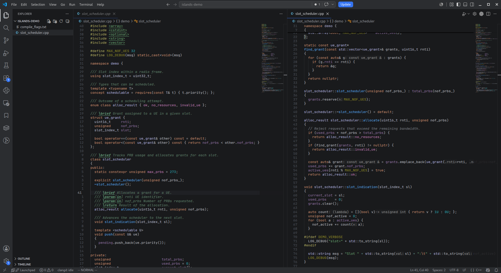

# Islands Dark C++

A dark VS Code color theme inspired by CLion's Islands Dark color scheme, tuned for C++.



## Features

- Editor colors taken from CLion's Islands Dark scheme: keywords, strings, numbers, comments, Doxygen.
- Semantic colors for C++: members vs locals and parameters, function declarations vs calls,
  classes vs typedefs, constants and enumerators, deduced `auto`, overloaded operators.
- Islands-style workbench: editor, side bar, tabs and panel share one surface inside a lighter frame.

## Install from release

Download the latest `.vsix` from the [releases page](https://github.com/frankist/islands-dark-vscode/releases/latest)
and install it, or with the GitHub CLI:

```sh
gh release download -R frankist/islands-dark-vscode -p '*.vsix' -D /tmp --clobber
code --install-extension /tmp/islands-dark-cpp-*.vsix --force
```

Then select **Islands Dark C++** with `Preferences: Color Theme`.

## Recommended setup

Semantic colors rely on the
[clangd](https://marketplace.visualstudio.com/items?itemName=llvm-vs-code-extensions.vscode-clangd)
extension. With Microsoft's C/C++ extension installed, disable its IntelliSense engine:

```json
"C_Cpp.intelliSenseEngine": "disabled"
```

For a CLion-like look, use JetBrains Mono:

```json
"editor.fontFamily": "'JetBrains Mono', monospace",
"editor.fontLigatures": false,
"editor.lineHeight": 1.2
```

## Build from source

```sh
npx @vscode/vsce package
code --install-extension islands-dark-cpp-0.1.0.vsix
```

## Disclaimer

Not affiliated with or endorsed by JetBrains. CLion is a trademark of JetBrains s.r.o.
